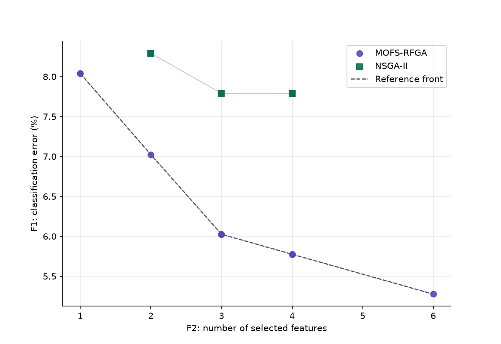

# moofs: Multi-Objective Optimization for Feature Selection

`MOOFS` is a reference Python library for multi-objective feature-selection
(MOFS) algorithms, built around a unified, scikit-learn compatible API.

<figure markdown>
  { width="640" }
  <figcaption>
    Pareto fronts returned by <code>moofs</code> on the Breast Cancer (WDBC)
    dataset. Each point is a feature subset; no point on a front is both
    smaller <em>and</em> more accurate than another on the same front.
  </figcaption>
</figure>
## The problem

Most feature-selection tools return a single subset, collapsing accuracy
and subset size into one score chosen ahead of time. But the two objectives
genuinely conflict, a smaller subset is rarely the most accurate one, so
any single answer hides a trade-off the user never got to see.

`moofs` instead searches for the full **Pareto front**: every subset for
which no other subset is simultaneously smaller and more accurate. You
inspect the trade-off directly, and pick the operating point that fits your
constraints: highest accuracy, fewest features, or the best balance.

## Key properties

- **Unified API** : every algorithm exposes
  `Algorithm(problem, pop_size, max_evals, seed).run()`, and a scikit-learn
  compatible `MOFSSelector` (`fit` / `transform` / `Pipeline`-ready).
- **Faithful to source papers** :  canonical hyperparameters from each paper
  are the defaults. Ambiguities in a paper's description are documented.
- **Comparable metrics** : IGD, hypervolume and set coverage follow the
  PlatEMO definitions used across the MOFS literature, so results are
  directly comparable to published tables.
- **Built-in visualization** : one-line Pareto-front plotting and
  multi-algorithm comparison, as shown above.


## Background

### Multi-objective optimization

A multi-objective optimization problem seeks a decision vector
$x = (x_1, \dots, x_D)$ minimizing $m$ objectives simultaneously, subject to
constraints:

$$
\min_{x} \; F(x) = \big(f_1(x), f_2(x), \dots, f_m(x)\big)
$$

$$
\text{subject to} \quad
g_i(x) \ge 0,\ i = 1, \dots, n,
\qquad
h_j(x) = 0,\ j = 1, \dots, o
$$

where $g_i$ and $h_j$ are the inequality and equality constraints, and $D$
is the dimensionality of the search space.

Because the objectives $f_1, \dots, f_m$ generally conflict, no single $x$
minimizes all of them at once. A solution $x^{(1)}$ **dominates** a solution
$x^{(2)}$, written $x^{(1)} \prec x^{(2)}$, if it is at least as good in
every objective and strictly better in at least one:

$$
x^{(1)} \prec x^{(2)}
\iff
\forall i,\ f_i(x^{(1)}) \le f_i(x^{(2)})
\ \ \text{and}\ \
\exists j,\ f_j(x^{(1)}) < f_j(x^{(2)})
$$

The **Pareto set** is the set of solutions not dominated by any other
feasible solution; its image under $F$ is the **Pareto front**. This is
what every algorithm in `moofs` searches for, and what `result.F` returns.


## Installation

```bash
pip install moofs
```

Requires Python ≥ 3.9. Core dependencies: `numpy`, `pandas`, `scikit-learn`,
`matplotlib`.

## Minimal example

```python
from moofs import MOFSSelector

selector = MOFSSelector(algorithm="mofs-rfga", max_evals=5000, random_state=0)
X_reduced = selector.fit_transform(X, y)
```

The figure above is produced with two lines:

```python
from moofs import plot_fronts
plot_fronts({"MOFS-RFGA": result_1, "NSGA-II": result_2}, reference=True)
```

Continue to [Getting started](getting_started.md) for the full workflow,
including the research-oriented API and Pareto-front comparison.

## Algorithms

| Algorithm | Authors | Venue | Reference |
|---|---|---|---|
| [MOFS-RFGA](algorithms/mofs_rfga.md) | Xue, Zhu & Neri | Applied Soft Computing, 2023 | [DOI](https://doi.org/10.1016/j.asoc.2023.109987) |
| [NSGA-II](algorithms/nsga2.md) | Deb, Pratap, Agarwal & Meyarivan | IEEE TEVC, 2002 | [DOI](https://doi.org/10.1109/4235.996017) |

Additional algorithms from the MOFS literature are planned; see the
[changelog](https://github.com/quick-ai-ml/moofs/blob/main/CHANGELOG.md).

## Evaluation protocol

Objectives follow the standard MOFS protocol: a k-NN classifier (k=3)
evaluated with 3-fold cross-validation gives the classification-error
objective; the number of selected features is the second objective.
Evaluations are memoized, and cache hits still count toward the evaluation
budget so comparisons across algorithms remain fair.

## Citation

If you use `moofs` in academic work, please cite the algorithm(s) you used
— see the [references section of the README](https://github.com/quick-ai-ml/moofs#citation)
for the BibTeX entries.

## License

MIT — see [LICENSE](https://github.com/quick-ai-ml/moofs/blob/main/LICENSE).
